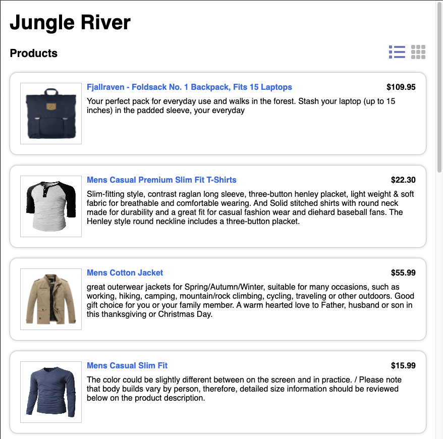
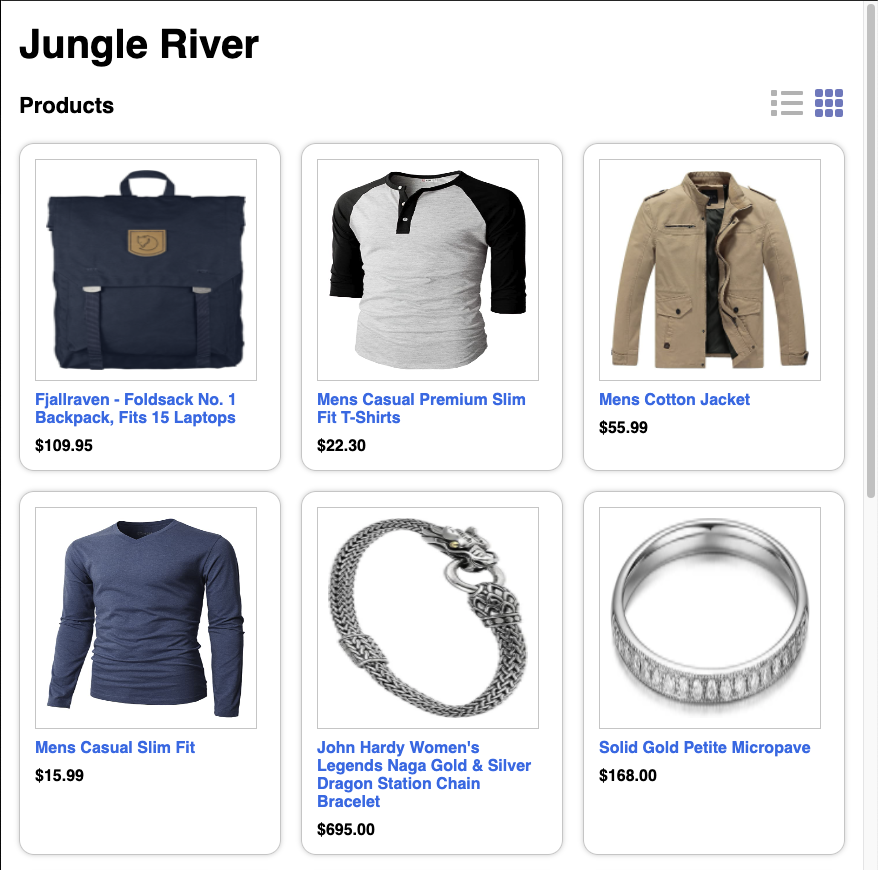

# Jungle River Project

We are building the Jungle River Store.

Your task is to create the products page:

- Display the products to the user.

- Allow the user to select from grid or list views.

Get the list of products from the API endpoint:
``https://fakestoreapi.com/products``

**Grid View**: Displays larger image, no product description.

**List View**: Displays smaller image with product description.

## Mock Product List View:

## Mock Product Grid View:

  
---

## Create React App Commands

### Available Scripts

In the project directory, you can run:

### `yarn start`

Runs the app in the development mode.\
Open [http://localhost:3000](http://localhost:3000) to view it in the browser.

The page will reload if you make edits.\
You will also see any lint errors in the console.

### `yarn test`

Launches the test runner in the interactive watch mode.\
See the section about [running tests](https://facebook.github.io/create-react-app/docs/running-tests) for more information.

### `yarn build`

Builds the app for production to the `build` folder.\
It correctly bundles React in production mode and optimizes the build for the best performance.

The build is minified and the filenames include the hashes.\
Your app is ready to be deployed!
